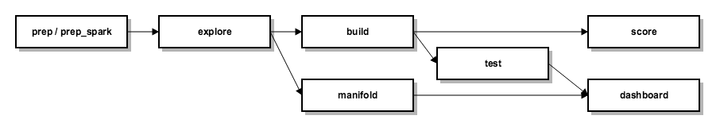

# mtbox

The package `mtbox` is a modeling toolbox that helps data scientists to build predictive models. The toolbox can build multiple models for multiple targets using **_scikit-learn_** and **_xgboost_**. It is a command line tool and uses a single `json` file for configuration.

* Prepare train and test data sets for multiple targets from Hive table or single csv file on an edge node or a Hadoop cluster with PySpark or pandas.
* Reduce variables with Random Forest model.
* Build Regularized Logistic Regression, Random Forest and/or Gradient Boosted Trees models with hyper-parameter grid search.
* Generate various model reports and test results on hold-out data.
* Create t-SNE for train data and visualize the embeddings for model diagnosis and segment profiling.
* Provide dashboard to display various model performance charts and univariate analysis charts for final model variables with Bokeh.
* Score new data set in Hive or text format with the best model in PySpark.

## Version

0.2.4

## What's new

* Added Hive integration for `score` command.
* Changed method name for existing logistic regression model based on Stochastic Gradient Descent (SGD) algorithm from `"logistic"` to `"logit_sgd"`.
* Added another logistics regression model implementation from sklearn with method name `"logit"`. This implementation is more robust than the existing SGD-based model.
* Added `manifold` command to create t-SNE and a page in dashboard to visualize the embeddings.
* Fixed the dependency installation issue and added a script to ease the installation.
* [Change Log](doc/change_log.md)

## How to access

The package `mtbox` is installed on the following Python environments on the Data Science edge node (dwbddisc1r2e.wellpoint.com) of Discovery cluster.

* [ stable release ] :  `/app/hca/adva/mtbox/py2-mtbox`
* [ latest development ] : `/app/hca/adva/mtbox/py2-mtbox-develop`

To access the toolbox, activate one of the above Python environments. For example:

```sh
$ source activate /app/hca/adva/mtbox/py2-mtbox
```

To see help messages:

```sh
(../py2-mtbox) $ mtbox
```

## Tutorial

* [Tutorial](doc/tutorial.md)
* mtbox commands dependency



## To do's

See [JIRA board] on HCADataScience JIRA project.

## Contributors

* Changhyeok Lee (maintainer)
* Brendan Fox
* Adam Stuckey
* Charles Arthur
    
## Suggestions / bug reports

Please email [Changhyeok Lee] or create an issue on [HCADataScience JIRA project] with `mtbox` Epic Link. 

   [Changhyeok Lee]: <mailto:changhyeok.lee@anthem.com> 
   [HCADataScience JIRA project]: <https://jira.anthem.com/projects/HCAD/summary>
   [JIRA board]: <https://jira.anthem.com/secure/RapidBoard.jspa?projectKey=HCAD&rapidView=623&view=planning>
